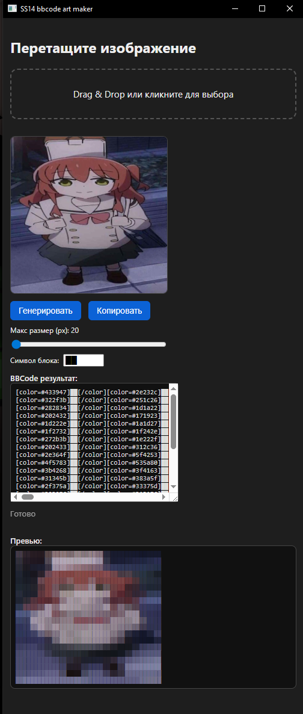

<div align="center">

# SS14 Art Maker

Преобразование изображений в цветной BBCode арт для Space Station 14 (и не только)I.



</div>

## ✨ Возможности

- Drag & Drop или выбор файла (PNG / JPG / GIF — первая кадр).
- Авто downscale до заданного размера (ползунок).
- Генерация цветного BBCode с тегами `[color=#RRGGBB]`.
- Быстрый предпросмотр результата прямо в приложении.
- Настраиваемый символ блока (по умолчанию двойной `██` для плотности).
- Обрезка слишком больших изображений через простой ресемплинг (среднее по блоку).

## 🖼 Как это выглядит

Скопируй пример BBCode в клиент / форум / чат, который поддерживает `[color]` BBCode:

```
[color=#ff0000]██[/color][color=#00ff00]██[/color][color=#0000ff]██[/color]
```

## 🚀 Скачивание релиза

В разделе Releases: открой последний релиз (теги `v*`) и скачай `art_maker.exe`.

## 🏗 Локальная сборка

Требуется Go (версия как в `go.mod`). Файл с build-тегом `dnd`, поэтому укажи тег при сборке:

```powershell
go build -tags dnd -o art_maker.exe .
```

Запуск:

```powershell
./art_maker.exe
```

## ⚙️ Технические детали

- Конвертация происходит полностью локально; изображения не отправляются в сеть.
- Downscale — простой усреднённый box sampling (ручная реализация для минимальных зависимостей).
- Цвет берётся напрямую из пикселей (`RGBA >> 8`), формируется hex.
- Оптимизации возможны (буферизация строк, SIMD, адаптивный символ), но текущая версия делает акцент на простоте.


## 🐞 Отладка / проблемы

| Симптом | Причина | Решение |
|---------|---------|---------|
| Пустое окно | WebView не инициализировался | Закрыть и перезапустить; проверить антивирус |
| Нет цветов / всё серое | Исходное изображение палитровое / альфа-чёрное | Попробуй другое изображение |
| Очень длинный вывод | Большое изображение + мелкий maxDim | Уменьши maxDim |

## 💡 Советы

- Один символ вместо `██` уменьшает ширину, но делает "дырки"; двойной плотнее.
- Слишком высокий maxDim быстро раздует размер BBCode — балансируй.
- Можно использовать моноширинный шрифт в месте вставки для более ровного вида.


## 🤝 Вклад

PR приветствуются: форк → ветка → коммит → PR.  
Для предложений — Issues.

---

Если этот инструмент полезен — поставь ⭐️ в репозитории.

